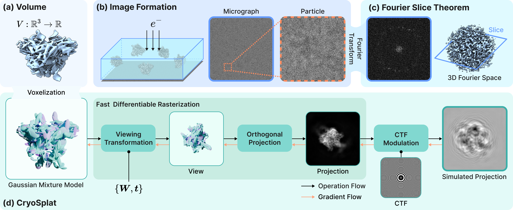

# [ICLR 2026] CryoSplat: Gaussian Splatting for Cryo-EM Homogeneous Reconstruction

Official implementation of:

**CryoSplat: Gaussian Splatting for Cryo-EM Homogeneous Reconstruction**  


📄 [OpenReview (ICLR 2026)](https://openreview.net/forum?id=dLaUZKBzta)


## Introduction
CryoSplat is a physics-consistent Gaussian Splatting framework
for cryo-EM homogeneous reconstruction.

By reformulating Gaussian Splatting as an orthogonal projection-aware
kernel aligned with cryo-EM image formation, CryoSplat enables stable
reconstruction directly from raw particle images with random initialization.

Experiments on real datasets demonstrate improved robustness
and efficiency over representative baselines.

<p align="center">
  <a href="assets/pipeline.png">
    
  </a>
</p>


## Installation

### 1. Create and activate a conda environment

```
conda create -n cryosplat python=3.9 -y  
conda activate cryosplat
```

### 2. (Optional) Check your CUDA toolkit version

```
nvcc -V
```

### 3. Install PyTorch

Choose **one** of the following depending on your CUDA version.

**CUDA 11.8**

```
conda install pytorch==2.5.1 torchvision==0.20.1 torchaudio==2.5.1 pytorch-cuda=11.8 -c pytorch -c nvidia
```

**CUDA 12.1**

```
conda install pytorch==2.5.1 torchvision==0.20.1 torchaudio==2.5.1 pytorch-cuda=12.1 -c pytorch -c nvidia
```

Verify the installation:

```
python -c "import torch; print(torch.__version__, torch.version.cuda)"
```

### 4. Install the differentiable GMM renderer

```
python -m pip install --no-build-isolation submodules/diff-gaussian-rasterization
```

### 5. Install dependencies

```
pip install cryodrgn
```


## Dataset Preparation

All datasets used in the paper follow the standard CryoDRGN data format and
preprocessing pipeline.

Please download and preprocess datasets according to the official CryoDRGN
EMPIAR instructions:

**https://github.com/zhonge/cryodrgn_empiar**

All experiments assume the same directory structure and metadata conventions.


## Quick Start

Each experiment reported in the paper is associated with a corresponding
training script. For example:

```
sh train_gmm_10049.sh
```

The scripts specify dataset paths, training hyperparameters, and output
directories, and can be used directly or adapted to other datasets.

For **runtime and GPU memory measurements**, enable the `--no-half-maps`
option to disable half-map reconstruction and FSC evaluation.


## Citation

If you find CryoSplat useful in your research, please cite: -->

```bibtex
@inproceedings{chen2026cryosplat,
  title={CryoSplat: Gaussian Splatting for Cryo-EM Homogeneous Reconstruction},
  author={Chen, Suyi and Ling, Haibin},
  booktitle={International Conference on Learning Representations (ICLR)},
  year={2026}
}
```


## Acknowledgements

- [3D Gaussian Splatting](https://github.com/graphdeco-inria/gaussian-splatting)
- [CryoDRGN](https://github.com/ml-struct-bio/cryodrgn)

This project introduces a Gaussian Splatting kernel adapted for cryo-EM reconstruction
and integrates it into a CryoDRGN-based training pipeline for reproducibility.


